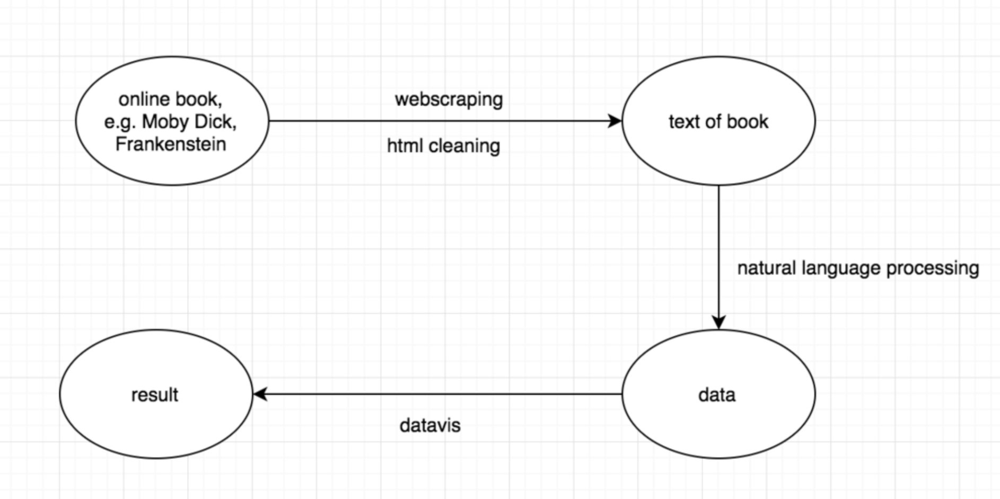

# NLP in Python

<p align="center">

</p>

## Description

<p align="center">

</p>

Follow the Data Science pipeline to plot frequency distributions of words in H. G. Wells's *The Time Machine*.
Novels are scraped from the website [Project Gutenberg](https://www.gutenberg.org/) using the Python package `requests` and extracted using `BeautifulSoup`. Analyze a novel using the Natural Language ToolKit (`nltk`).
The process teaches critical aspects of Natural Language Processing (NLP) such as tokenization and stopwords.
Visualize word frequency distributions of any novel from Project Gutenberg.
The NLP skills developed, however, are applicable to much of what Data Scientists encounter as the vast proportion of the world's data is unstructured data and includes a great deal of text.

## Prerequisites

Familiarization with...

* programming fundamentals of the Python programming language (e.g., variables, for loops);
* Jupyter Notebooks;
* terminal/shell.

## Getting set up computationally

## Git
At the heart of GitHub is an open source version control system (VCS) called [Git](http://product.hubspot.com/blog/git-and-github-tutorial-for-beginners). Git is responsible for everything GitHub-related that happens locally on your computer.  To use Git on the command line, you'll need to download, install, and configure Git on your computer.

### 1.a Download Git (if you (Windows users) haven't already)

If you do not already have [Git](https://git-for-windows.github.io/), download for BASH or GUI access to the premier version control [SCM](https://git-scm.com/book/en/v2/Getting-Started-Installing-Git).

### 1.b Clone the repository

Executing the following in a Git capable terminal:

```
git clone https://github.com/lonesome-data/CY3650-Project
```
Alternatively, download the zip file of the repository at the top of the main page. If you prefer not to use git or don't have experience with it, this a good option.  Just be mindful of where the file is unzipped.

### 2. Download Anaconda (if you haven't already)

If you do not already have the [Anaconda](https://www.anaconda.com/download/) distribution of Python 3, go get it (n.b., you can also do this w/out Anaconda using `pip` to install the required packages, however Anaconda is great for Data Science so you are encouraged to use it).

### 3. Create your conda environment for this session

Navigate to the relevant directory `CY3650-Project` and install required packages in a new conda [environment](https://conda.io/docs/user-guide/tasks/build-packages/environment-variables.html):

```
conda env create -f environment.yml
```

This will create a new environment called CY3650_nlp. To activate the environment on OSX/Linux, execute

```
source activate CY3650_nlp
```
On Windows, execute

```
activate CY3650_nlp
```
### 4. Open your Jupyter notebook

In the terminal, execute 

```
jupyter notebook
```

Then open the notebook `CY3650_NLP.ipynb` and we're ready to get coding. Enjoy.

### Code
The code in this repository is released under the [MIT license](LICENSE). Read more at the [Open Source Initiative](https://opensource.org/licenses/MIT). 
